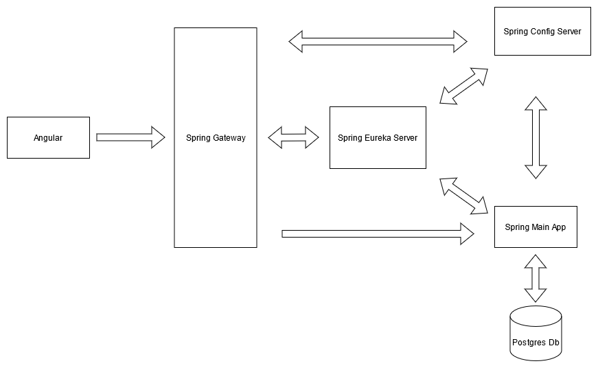
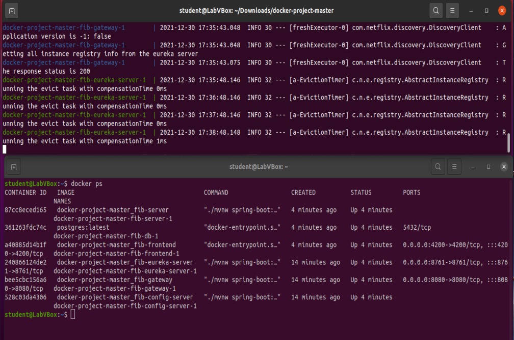
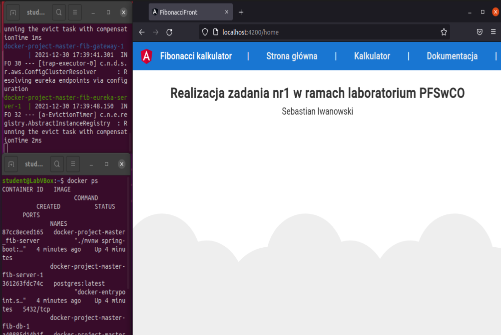
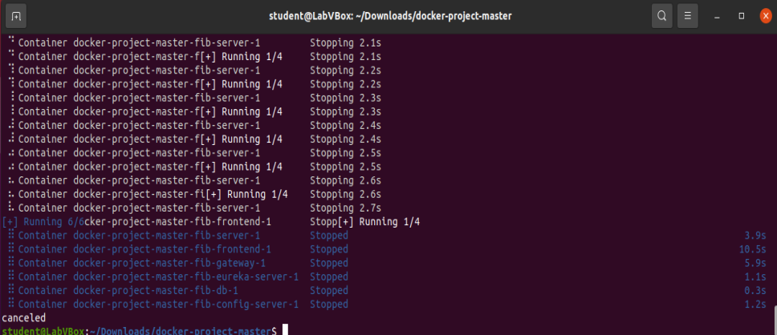

# Dokumentacja

**Schemat aplikacji**

Frontend został stworzony w frameworku Angular, backend w Javie z użyciem frameworka Spring.

**Krótki opis działania aplikacji po stronie backendowej:**

*   _Spring Config Server_ - odpowiedzialny za dostarczanie konfiguracji dla każdego z mikroserwisów.
*   _Spring Eureka Server_ - odpowiedzialny za wyszukiwanie, rejestrowanie i organizacje pracy wszystkich podłączonych mikroserwisów
*   _Spring Gateway_ - odpowiedzialny za przekierowywanie zapytań do odpowiednich mikroserwisów
*   _Spring Main App_ - główny mikroserwis, odpowiedzialny za logikę działania aplikacji
*   _Postgres Db_ - baza danych aplikacji

Wszystkie serwisy pobierają swoją konfiguracje z mikroserwisu _Spring Config Server_. Następnie każdy mikroserwis rejestruję się w _Spring Eureka Server_ aby można było je znaleźć po nazwie, bez konieczności wskazywania konkretnego portu. Wszystkie zapytania odpierane są przez _Spring Gateway_, który przekierowuję je na odpowiednie mikroserwisy. Cała logika aplikacji znajduję się w _Spring Main App_, który połączony jest również z bazą Postgresa.

# Uruchomienie

Należy pobrać repozytorium, wejść do głównego folderu i otworzyć w nim okno konsoli. Następnie należy użyć polecenia:  
 _docker compose up --build_  

Aplikacja dostępna jest pod adresem: http://localhost:4200
  
Potwierdzenia działania aplikacji:

